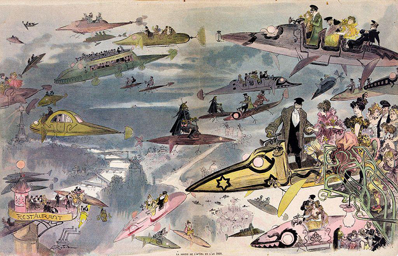

Structure of 2018-19
======================

# An Introduction to Futures

## Faculty
Elisabet Roselló Román

## Syllabus and Learning Objectives

**Introduction to Futures Studies and Futures Thinking**

The future is currently near of being a new buzzword. The media is full of narratives of futuristic utopias and distopias, usually techno-centered. But the future is not a classic Fate. The Future, in fact, doesn’t exist. That means that the future is actually a set of probabilities and possibilities. Creatives, designers, policy-makers and agents of change have an agency on it This course introduces students of the Master DfEF to Futures Theory and Futures Thinking as a set of tools and as a conceptual field subject of interest within different areas and trends of design, such as Strategic Design or Critical Design. This course also includes theoretical introductions at the most relevant foresight frameworks for designers and agents of change, a reframe on futures conception and a set of tools which will link with other courses of the master. The students will reach a more critical futures-oriented mindset, needed for developing different alternative scenarios

## Total Duration

10 a.m.-1 p.m, Mon-Fri 1st week December (15h max)

## Structure and Phases

### Day 1 (December 3th). Introduction to the Future

· What is the Future? What is not the future?

· About time and possibilities

· Unpredictability and Future Laws

· Scenarios -a show of them

· Debate

### Day 2 (December 4th). Frameworks and theories

· Futures Studies

· Strategic Foresight

· Postnormal Science and Postnormal Times Theory

### Day 3 (December 5th - Morning session). How the future is build

· The 3 areas feedback cycle

· Trends and Forces: Fitting, desirability, expectations…

· Narratives and Scenarios

· Introduction to Systems Thinking

### Day 3 (December 5th - Afternoon session). Exercising “futures muscle”

· Futures Archaeology and Futures Pop

· Speculative Design, Experiential Futures and Design Fiction (and a quick mention to Transition Design)

### Day 4 (December 7th). A Day in the Future

· PESTEL trends in play

· Scenarios: methods

· Let’s play with the future!

## Output
Depending on concrete exercises

## Grading Method
Assistance and participation on class exercises

## Bibliography

Hines, Andy; Bishop, Peter (2007) Thinking about the future: guidelines for strategic foresight. Washington: Social Technologies

Dunne, Anthony; Rabby, Fiona (2013). Speculative Everything: Design, fiction and Social Dreaming. Cambridge (Massachussets): MIT Press

## Infrastructure Needs
Screen and projector

## Other Needs
Sheets of paper, post-its, pens…

## Elisabet Rosello

Strategic Innovation consultant specialised on trends analysis and futures research. Fellow at the Center for Postnormal Policy and Futures Studies. Founder of Spanish platform Postfuturear, for Futures Studies research and dissemination for different audiences. She has worked as a trends and offline user experience analyst, as an innovation researcher for creative agencies, universities (IGOP-UAB, IN3-UOC), and public institutions. She has been project manager for the Barcelona Mini Maker Faire 2014. She is lecturer occasionally in different educative institutions as Universitat de Barcelona, BAU Escola de Disseny, among others, and had collaborated in different media, from CCCBLab to RNE4.
