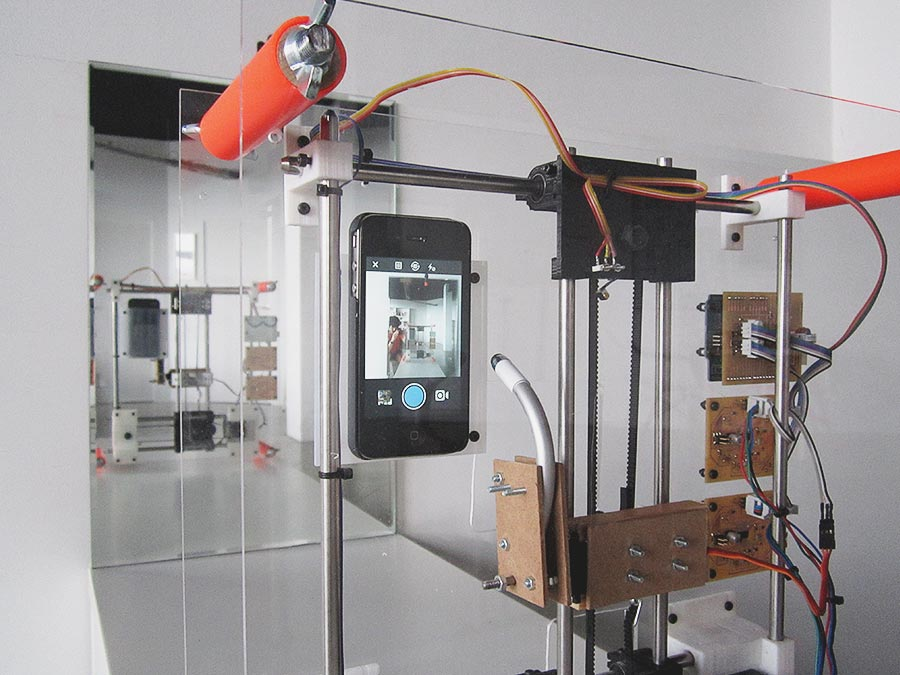

Structure of 2018-19
======================

# From Bits to Atoms

## Faculty
Santi Fuentemilla, Xavi Dominguez, Eduardo Chamorro and Esteban Gimenez

## Syllabus and Learning Objectives

Fab Labs and advanced manufacturing infrastructure are making accessible for any citizen to make anything anywhere while sharing it with global networks of knowledge, which allows accelerating design, development and deployment processes for new products to be born. Traditional planning and urbanism are being disrupted by the acceleration of technology and the dynamic transformation of society during the last half century; it is important to rethink how we make things and why, and generate active and practical conversations through projects and prototypes that become manifests itself.

Bits<>Atoms is a practical and intensive one-week training program and a broad-reaching introduction to the Fab Lab environment. It has been designed to fill knowledge gaps and aimed to prepare students to succeed and improve their experience during Fab Academy.

During this workshop, we will be going over the basic skills needed to design, develop and fabricate almost anything in a Fab Lab, as well as how to manage the resources necessary to its proper operation.

Our active learning methodology is based on the practice of small exercises, designed to encourage the creativity and imagination of the participants, as well as stimulate the search for tools and solutions for their correct definition.

The week provides the tools and skills for launching your ideas into the future of digital fabrication and distributed manufacturing. We will offer an impact experience, seeking to inspire and motivate the participants to use the possibilities of digital manufacturing and technologies to prototype, design, fabricate and program an “honest” mechanical artefact that “makes” something.

## Total Duration
Classes: 10-13 p.m, Mon-Fri (15 per week)

Student work hours: 15-19 p.m, Mon-Fri (20 per week)

Total hours per student: 35 hours

## Structure and Phases

### D1 - Fablab, Fabacademy Introduction

- Intro Fablab and Fabacademy

- Safe Rules and Hand tool training

- Documentation

- Machine design challenge (inspiration ideas, rules, documentation….)

### D2 - Design and Fabrication

- Review presentations

- Digital fabrication intro (Laser cut, CNC, 3D printing)

- Parametric modeling

### D3 - Electronics

- Review presentations

- Inputs: sensor fabrication

- Outputs: Motors, Stepper library, arduino

- Gode, GRBL

### D4 - Interaction

- Review presentations

- Based on the evolution and needs of the week, we will focus on Processing, Firefly, Python, appinventor, VR

### D5 - Presentation

- Work hours

- Final Presentations

## Output

“honest” mechanical artifact (1 input + 2 output + replicable + 2 differents fabrication process)

## Grading Method
- Documentation, 50%

- Participation: 30%

- Presentation: 15%

- If it does not explode: 5%

- Daily reflections: 30%

## Background Research Material
Fab Academy

Fab Foundation

Fab Academy BCN

Fab Zero

Daniel Armengol Altayo

Machines that Make

Designing Reality

Make: The Maker’s Manual: A Practical Guide to the New Industrial Revolution

The 3D Printing Handbook: Technologies, design and applications

Fab: The Coming Revolution on Your Desktop - from Personal Computers to Personal Fabrication

## Requirements for the Students
Motivation

## Infrastructure Needs
Fablab facilities and Academy room

## Student’ Artifacts
From Bits to Atoms
