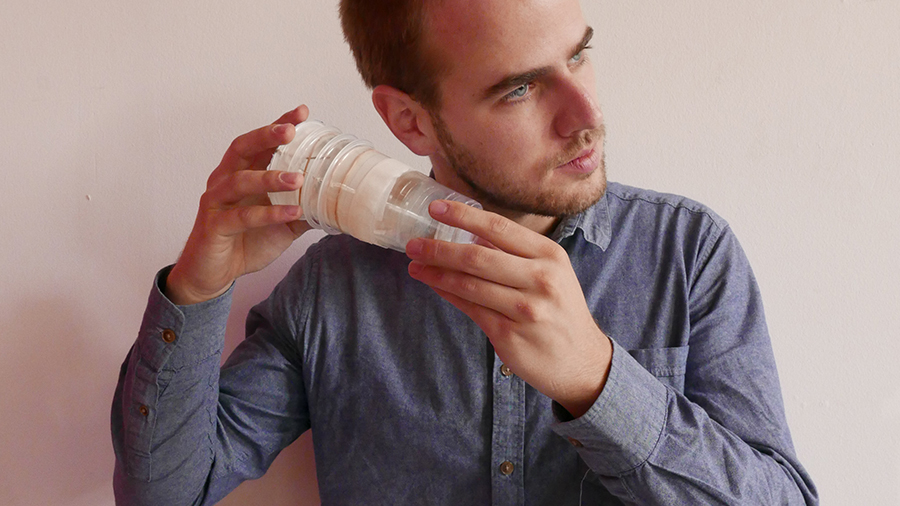

Structure of 2018-19
======================

# Living with Ideas

### Temporal aspects of embodied living with prototypes

## Faculty
 Oscar Tomico, Kristina Andersen, Angella Mackey and Ron Wakkary

## Syllabus

Students will participate in a series of workshop activities that address challenges for quickly embodying concepts, and addressing them through lived experiences.

Throughout the week, students will engage in early and easy making processes. They will address experiences of these things through the body. Each student will move through: · Lo-fi version of their project/concept · Different time scales · Move from speculation to having a component of reality for their concept.

On the final day students will present an embodied concept.

## Total Duration

Classes: 3-6pm, Mon-Fri

Student work hours: 20 hours

## Structure and Phases
**Day 1**: Workshop: Make a magic machine. Facilitated by David McCallum and Kristina Andersen

**Day 2**: Workshop: Wearing the digital. Facilitated by Angella Mackey

**Day 3**: Workshop: Living with the thing. Presentation by Ron Wakkary. Facilitated by Angella Mackey

**Day 4**: Work in the studio to build your idea.

**Day 5**: Student presentations. Critique and discussion. Facilitated by David McCallum and Kristina Andersen

## Output

Research artifacts, lo-fi version of project/concept.

## Grading Method

Participation and reflection required.

## Kristina Andersen

Kristina Andersen is assistant professor at the Future Everyday cluster of the Department of Industrial Design. Her work is concerned with how we can allow each other to imagine our possible technological futures through digital craftsmanship and collaborations with semi intelligent machines in the context of material practices of soft fiber-based things. How can we innovate, design and act around that which is yet to be imagined? Who gets to drive innovation processes? And how can we reframe our methodologies to include the complex cultural, political, and personal aspects of life? Can we approach this through making (and thinking) about technology, communities and materials as a way to construct visions of the unknown?    Andersen was based at STEIM for 14 years, she was part of the Making Things Public art research program at the Gerrit Rietveld Academie and lead the Instruments and Interfaces master’s degree program at the Royal Conservatoire in The Hague. She is a longstanding advisor of the Stimuleringsfonds Creatieve Industrie, and currently acts as expert reviewer for H2020, ICT and FET for both application and project reviews. Andersen co-chaired the CHI art 2018, CHI Design paper track 2019 and 2020, and DIS pictorials 2019.

Email Address h.k.g.andersen@tue.nl

## Angella Mackay

Angella Mackey is a designer, researcher and educator. She currently works at the Amsterdam University of Applied Sciences (AUAS), teaching Design Processes for the Masters Digital Design (MSc.) program, as well as doing research with the Play and Civic Media research group. She is also a Marie Skłodowska-Curie doctoral fellow at Eindhoven University of Technology and Philips Lighting Research. For over a decade her practise as a designer has investigated wearable technologies in art, research and commercial contexts. She has designed functional garments in a wide range of industries, from medical to commercial space flight, and lectures on the design challenges of integrating electronics into fashion. Most notably, she founded Vega Wearable Light, a line of illuminated outerwear for style-conscious cyclists from 2010-2014.

Mackey's doctoral research focuses on explorations of digital materials combined with fashion and everyday clothing-wearing practices as a means of gaining insight into future smart-garment systems.

Email Address a.m.mackey@hva.nl

Linkedin Account https://www.linkedin.com/in/angellamackey/
