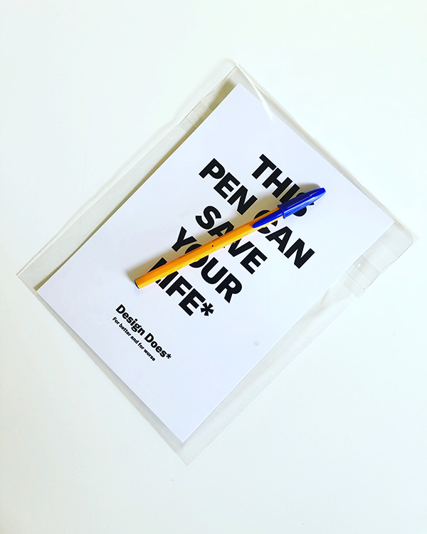

Structure of 2019-20
======================

# Exploring Hybrid Profiles in Design

## Faculty
Oscar Tomico

### Assistant
Sara Gonzalez de Ubieta
From architecture to shoe making and material experimentation.

Laura Clèries
From a PhD in Chemistry to future scouting and trend setting.

Domestic Data Streamers
With Pol Trias and Marta Handenawer. From product design to data enabled communication.

## Syllabus and Learning Objectives

Research has shown that most of the jobs opportunities and future challenges that will arise in the next years still don’t exist. Instead of seeing it as a thread, we want you to look at it as an opportunity. An opportunity to actively create your own path, your own vision and identity rather than passively wait for what it is needed.

In MDEF we believe that learning should be driven by your motivations and not by our (the teachers) thoughts. We want you to be in control of your own development specially in a master program full of activities.
In this course, critical reflection will help you to map your strengths and weaknesses. Group discussions will make you aware about how your thinking, interests and values differ from others. By means of a series of visits to key professionals, that have undergone a shift in their careers, we want you to plan a strategic turn for yourself. We will provide you with a variety of knowledge, skills and attitudes to compare yourself with.
At the end of this course we expect you to understand who you are and what makes you unique (identity), have created a personal “vision” of your future as a professional, and a draft development plan on how to achieve it.

## Total Duration

Classes: 3-5 p.m, Mon-Fri

Student work hours: 20 per week

Total hours per student: 35

## Structure and Phases

### Homework (bootcamp):

Finalize or improve your 1st post on your personal web.

### Day 1

Vision and Identity class, tools and techniques for self-reflection.

### Day 2

to 4: Visit and reflect on the hybrid profiles presented (points of convergence and divergence).

**Each visit will consist of the following:**

· Introduction to their professional practice and where they work (university, study, company, …)

· Background (how did they get where they are now)

· Practical exercise on a topic that is key for them

· Reflection with MDEF students about similarities and differences in their understanding of what design is, the role of technology and value for society.

### Day 5

Personal development plan class, classes and master project.*

## Output

In this course personal and group reflections are key, that is why we expect you to deliver a series of notes and conclusions from each activity. We want you to post them in your personal blog daily so other students can see them too. The final result should be a text relating your current identity as a designer, your vision of the future, and a personal development plan for the master (and beyond).

## Grading Method

Final document: 70%

Daily reflections: 30%

## Bibliography

Annotated portfolios
Schön, D. (1983). The Reflective Practitioner: How professionals think in action. London: Temple Smith

The reflective transformative design process.
Hummels, C. C. M., & Frens, J. W. (2009). In CHI 2009 - digital life, new world: conference proceedings and extended abstracts; the 27th Annual CHI Conference on Human Factors in Computing Systems, April 4 - 9, 2009 in Boston, USA (pp. 2655-2658). New York: Association for Computing Machinery, Inc.

Designing for the unknown: A design process for the future generation of highly interactive systems and products.

Hummels, C. and Frens, J. (2008). Proceedings Conference on EPDE, Barcelona, Spain, 4-5 September 2008, pp. 204-209.

Eindhoven designs volume 2: Developing the competence of designing intelligent systems.

Hummels, C. and Vinke, D. (2009). Eindhoven University of Technology.
