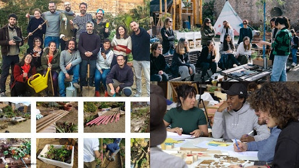
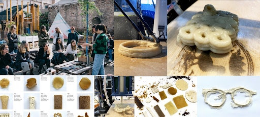

Structure of 2020-21
======================

# Design Studio 2

### Embodying Emergent Contexts

## Track
Application

## Faculty
Tomas Diez, Oscar Tomico, Mariana Quintero   

## Syllabus

MDEF Research, Design and Development studios aim to take research areas of interest and initial project ideas into an advanced concretion point, and execution plan. The studio structure in three terms could be understood as follows:

**TERM 1 Research**: Understanding what it means to design for emergent futures. Analysing the past and finding weak signals. References, state of the art. Identifying areas of interest. Experimenting from the first-person perspective.

**TERM 2 Design**: Forming the present through interventions in the real world. Building the foundations of your design space, forming strategic partnerships. Applying knowledge into practice through iterative prototyping. Testing ideas and prototypes in the real world.

**TERM 3 Development**: Refining interventions and identifying desirable futures. Establishing roadmaps for the construction of emergent narratives.. Communicating and disseminating your project through speculative design.

## When  
**Tuesdays** from 3 to 6 pm, every two weeks

## Schedule

### 12/01 Kick off - Reframing your project

**Goals**: Critically look back at your project, reflect on the feedback from the design dialogues, and propose a new scope, goals and next steps.

**Activity**: Briefly present in class 3 of the main learning points from the 1st trimester.

**Deliverable**: New project goals and next steps including a proposal for the 1st Iteration of the second trimester (a draft will be discussed during the design reviews the week after)

**Task**: Carry out a 1st design intervention from a 1PP (involving yourself in the context you want to work on).

### 26/01 Autoethnography - A 1PP Design intervention in context.

**Goals**: Understand better yourself as a design tool in contexts, learn how to properly document, analyse and make sense of a design action from a 1PP.  

**Activity**: Present your results from your 1PP design intervention. Reflect on your work based on the presentation and guidelines given in class.

**Deliverable**: Document the 1PP design intervention, analyse it and reflect on the findings.

**Task**: Plan and execute a 2nd design intervention, a collective design intervention.

### 09/02 Post-human design. A collective design action with humans and non-humans

**Goals**: Transition from Human-centered design to Post-human design. Understand the agency of the context you are working in. Let the human and non-human actors be a driving force in your project.

**Activity**: Present your results from your collective design intervention and map the actors and infrastructure you involved. Reflect on your project from a Post-human design perspective.

**Deliverable**: Document the collective design intervention, analyse it and reflect on the findings.

**Task**: Plan and execute a 3rd design intervention, a final and more complete one.

### 23/02 Futures scenarios. 3rd iteration presentations

**Goals**: Abstract your alternative presents from the design interventions into the future. Learn about future scouting.

**Activity**: Present your results from your 3rd design intervention. Create a first draft of your future scenarios by means of a cartogram.

**Deliverable**: Document the final design intervention, analyze it and reflect on the findings. Create your own future scenarios and cartograms.

**Task**: Map and analyze the evolution of your design space over the 3 iterations (your trajectory).

### 09/03 Design Dialogues II Preparation

**Goals**: Create a collective and individual building up plan for the design dialogues exhibition in relation to your future scenarios.

**Activity**: Present your future scenarios, your cartograms. Group dynamic to create themes and groups of projects based on the work done on the communication and documentation track.

**Deliverable**: Planning of the exhibition, space allocation and special needs.

**Task**: Work on the design dialogues deliverables.

### 23/03 Design Dialogues (deliverables):

2-5 min video-documentary (video-journaling) of your 3 Term II interventions - for presenting during Design Dialogues and for uploading to the Emergent Futures Community

Visual material to support the exhibition.

Evolution of physical and/or Digital prototypes from your Design Space

Thesis Draft - Chapters 3-7 made up of the weekly deliverables for this term. (Due until the end of Easter Holidays):

- **Chapter 3**: Reframing of the project

- **Chapter 4**: Autoethnography - First Intervention

- **Chapter 5**: Post-Human Design - Second Intervention

- **Chapter 6**: Future Scouting - Third Intervention

- **Chapter 7**: Towards a Personal Narrative - Documentation and Communication Seminar
